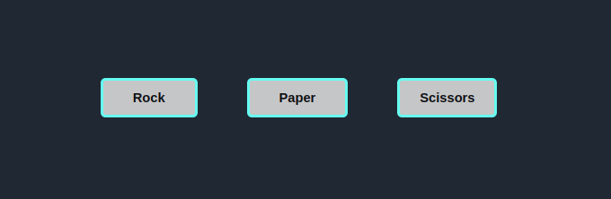
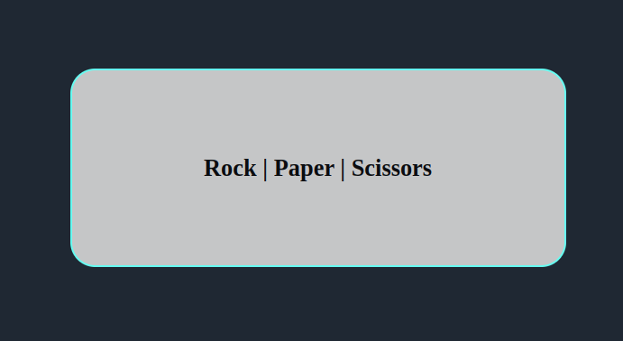
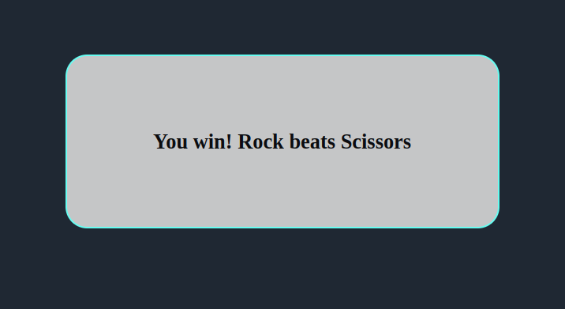
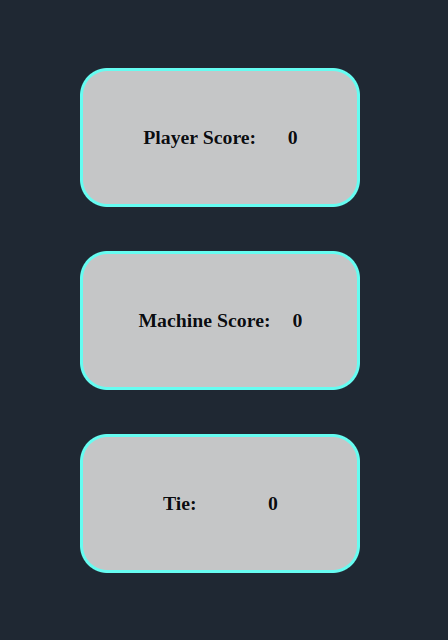

# **ROCK PAPER SCISSORS**

## **Introduction**
This is my implementation of the popular game rock-paper-scissors.Traditionally the game is played by 2 "in which each player simultaneously forms one of three shapes with an outstretched hand", according to [wikipedia](https://en.wikipedia.org/wiki/Rock_paper_scissors).

## **Technologies used**

To complete this project, I used the following technologies:

## **Gameplay**
The game is played by clicking any of the rock, paper or scissors buttons. The user (player) plays against the computer (machine) in this implementation.

After each click of the button, text is displayed indicating if the user or computer won that round of the game or if the round ended in a tie.

After the text has been displayed, a score is displayed on the score board. The score is calculated based on who won the particular round of the game with each round won being given 1 point.

The game can be played [here](https://wilsonsiaw.github.io/Project-Portfolio/rock-paper-scissors/).

## **Challenges faced**

I faced two major challenges during this project that I am working to resolve. 

The first one was around getting the game to stop playing one the computer or user gets to a certain number of points. For example, the game should be able to display the winner if either the computer or the player gets to say 10 points.

Linked to this is the next challenge I faced. This challenge was around getting the game to refresh or restart itself after a winner has been declared.

These are the two main challenges I faced, and I am working to find a solution for them and will update the game as soon as I find solutions.

